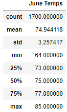
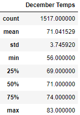

# surfs_up

## Overview
In this assignment, temperature data from the island of Oahu is analyzed comparing data for the months of June and December to determine if a surf and ice cream shop business is sustainable year-round.

Raw weather data from multiple weather stations was provided in a sqlite database file and a sqlalchemy query was run to extract all temperatures from the month of June and December.  This data was converted to a pandas dataframe and statistical analysis was then completed on each month in order to show differences and variances between the two months.  

## Results
Three main results from this analysis are:
- The average temperature in June is roughly 4 degrees warmer compared to December
- December has a 0.5 higher standard deviation, which is a larger value, but indicates that temperature is fairly stable in December as well and does not swing wildly up and down 
- The minimum temperature is 8 degrees colder in December compared to June, however, the quartiles are all only 3-4 degrees colder for December comparatively.  This indicates again, there are not large variances in the months as it pertains to temperature variances.

Statistical Breakdown for each month shown here: 

## Summary
Based on the data analyzed and the statistical elements I would recommend a surf and ice cream business to operate all year in Oahu.  Even in December, the average temperature is 71 degrees and overall December is very similar to June weather, just 3-4 degrees colder on most days.  Given that the ocean temperature is very comfortable, customers will want to surf and eat ice cream in the month of December as well as the rest of the year.

Two recommendations for additional analysis would be to:
1. Conduct the same analysis for precipitation between the two months.  Even if the temperatures are still nice all year, it could impact sales if its raining most days during the winter months.
2. Conduct analysis on all the months of the year and plot average temperatures/precipitation to further demonstrate a full year-round picture of how weather could impact sales.